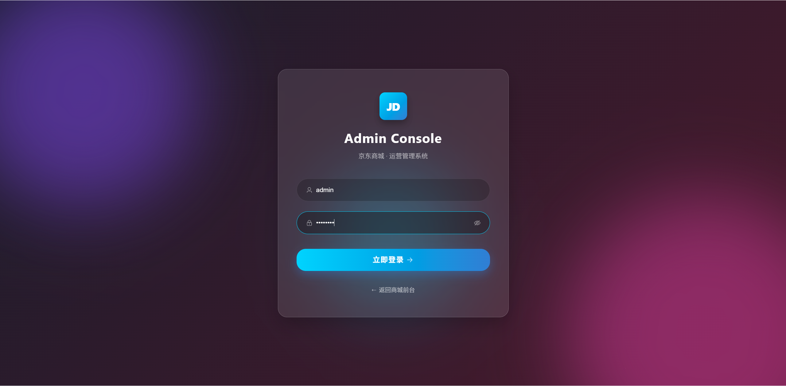
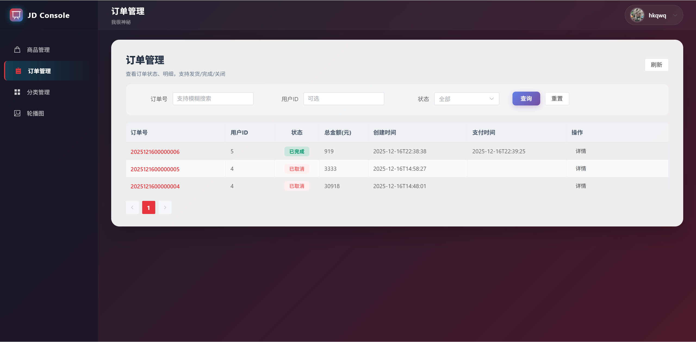
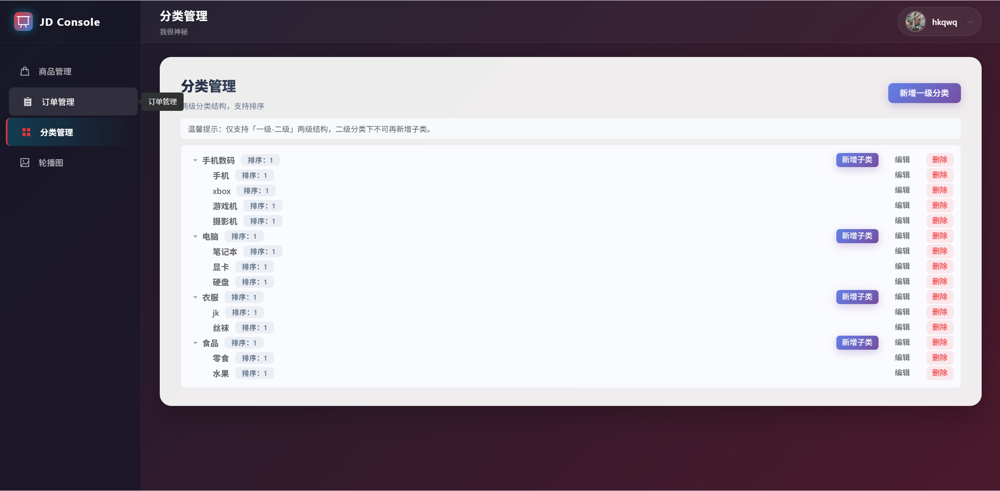
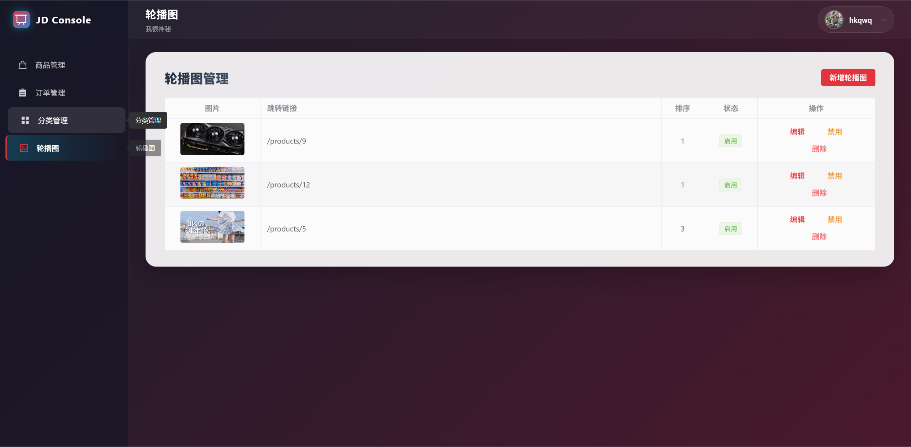
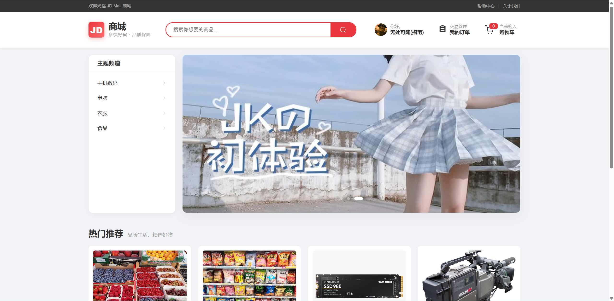
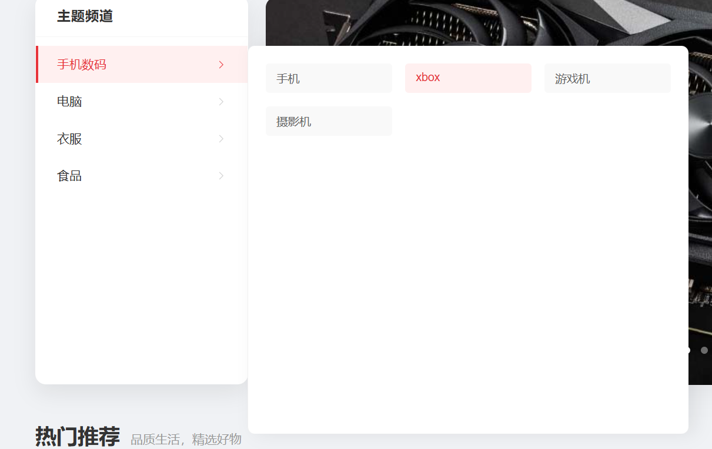
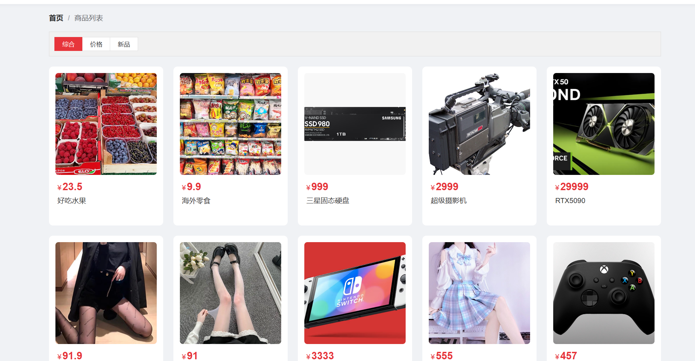
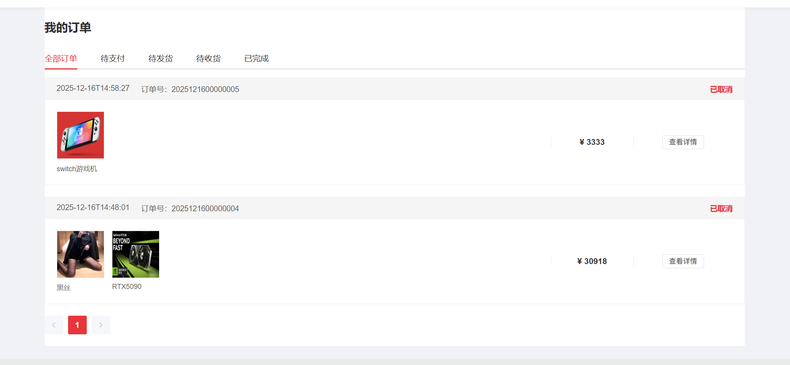
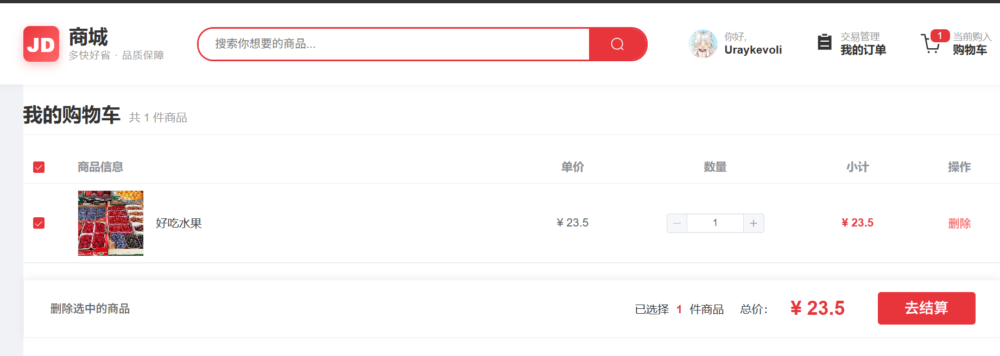

# JD Online Mall Frontend (京东在线商城前端)

这是一个基于 **Vue 3** + **Vite** 构建的电商平台前端项目。项目集成了 **Element Plus** UI 组件库，使用 **Pinia** 进行状态管理，并实现了**前台商城**与**后台管理系统**的双端逻辑分离。

## 预览截图

管理员端：










用户端：











## 🛠 技术栈 (Tech Stack)

本项目采用了当前主流的前端开发技术栈：

- **核心框架**: [Vue 3](https://vuejs.org/) (Composition API)
- **构建工具**: [Vite 7](https://vitejs.dev/)
- **路由管理**: [Vue Router 4](https://router.vuejs.org/)
- **状态管理**: [Pinia](https://pinia.vuejs.org/)
- **UI 组件库**: [Element Plus](https://element-plus.org/)
- **HTTP 请求**: [Axios](https://axios-http.com/)
- **代码规范**: ESLint + Prettier

## ✨ 功能特性 (Features)

根据项目结构，系统分为前台用户端和后台管理端两个部分：

### 🛍️ 前台商城 (Client)
面向普通用户的购物界面：
- **用户认证**: 登录、注册 (`src/views/Auth`)
- **首页展示**: 商城首页、轮播图展示 (`src/views/Home`)
- **商品模块**: 商品列表浏览、商品详情展示 (`src/views/Product`)
- **购物车**: 购物车管理、商品数量调整 (`src/views/Cart`)
- **订单流程**: 创建订单、订单列表、订单详情 (`src/views/Order`)
- **个人中心**: 收货地址管理 (`src/views/Profile`)

### 🛡️ 后台管理 (Admin)
面向管理员的后台管理系统（独立路由 `/admin`）：
- **管理员登录**: 独立的后台登录页 (`src/views/Admin/AdminLogin.vue`)
- **仪表盘**: 数据概览 (`Dashboard`)
- **商品管理**: 商品的上架、编辑与维护 (`ProductPanel`)
- **订单管理**: 查看和处理用户订单 (`OrderPanel`)
- **分类管理**: 商品分类维护 (`CategoryPanel`)
- **运营管理**: 轮播图配置 (`BannerPanel`)

## ⚙️ 环境要求 (Prerequisites)

根据 `package.json` 配置，请确保您的运行环境满足以下要求：

- **Node.js**: `^20.19.0` 或 `>=22.12.0`
- **包管理器**: npm, yarn, 或 pnpm

## 🚀 快速开始 (Getting Started)

### 1. 安装依赖

```bash
npm install
# 或者
yarn install
# 或者
pnpm install
```

### 2. 开发模式运行

启动本地开发服务器：

```bash
npm run dev
```

启动后访问控制台输出的地址（通常为 `http://localhost:5173`）

### 3. 代码检查与格式化

```bash
# 执行 ESLint 检查并修复
npm run lint

# 执行 Prettier 格式化
npm run format
```

### 4. 生产环境构建

```bash
npm run build
```

构建产物将输出到 `dist` 目录，可用于生产环境部署

### 5. 预览构建产物

```bash
npm run preview
```

## 📂 目录结构 (Directory Structure)

```Plaintext
src/
├── api/                 # API 接口管理
│   ├── admin.js         # 后台管理相关接口
│   ├── cart.js          # 购物车接口
│   ├── order.js         # 订单接口
│   ├── product.js       # 商品接口
│   ├── request.js       # Axios 封装 (包含双端 Token 处理逻辑)
│   └── ...
├── components/          # 公共组件
│   ├── Layout/          # 布局组件 (Header, Footer)
│   └── ProductCard.vue  # 商品卡片组件
├── router/              # 路由配置
├── stores/              # Pinia 状态仓库
│   ├── adminStore.js    # 后台管理员状态
│   ├── userStore.js     # 前台用户状态
│   └── cartStore.js     # 购物车状态
├── styles/              # 全局样式
├── views/               # 页面视图
│   ├── Admin/           # 后台管理系统页面
│   ├── Auth/            # 登录注册页面
│   ├── Cart/            # 购物车页面
│   ├── Home/            # 首页
│   ├── Order/           # 订单相关页面
│   ├── Product/         # 商品相关页面
│   └── Profile/         # 个人中心
├── App.vue              # 根组件
└── main.js              # 入口文件
```

## 💡 开发说明

### 接口请求封装

项目在 `src/api/request.js` 中对 Axios 进行了二次封装，包含以下核心逻辑：

- **动态 Token 注入**: 根据请求 URL 是否包含 `/admin` 自动判断使用 `userStore` 还是 `adminStore` 的 Token
- **统一错误处理**:
  - `40002`: 登录失效（根据前后台自动跳转不同登录页）
  - `40003`: 无权限访问
  - `40004`: 业务逻辑错误（如库存不足）
- **BaseURL**: 默认为 `/api`，开发时请配置 Vite 代理解决跨域问题


